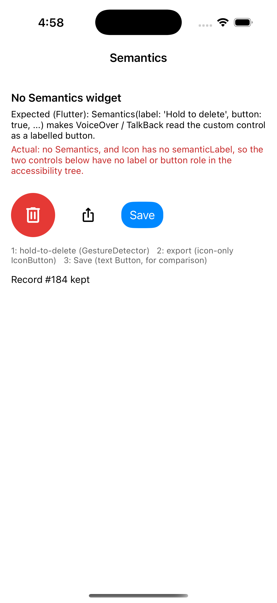

# Repro: no Semantics widget, so custom controls have no accessibility label or role

DartNative 1.0.0 has no `Semantics` (nor `MergeSemantics` / `ExcludeSemantics`), and `Icon` has no `semanticLabel`. A custom control built from `GestureDetector` (a hold-to-delete button) or an icon-only `IconButton` therefore can't be given a label or a button role, and VoiceOver / TalkBack users can't tell what it is.

## Run

`dn run` (iOS simulator; Android behaves the same unless stated).

## What you'll see

Three controls in a row:

1. A red hold-to-delete circle (`GestureDetector(onLongPress:)` around a `Container` + `Icon`).
2. An icon-only `IconButton` (export).
3. A text `Button(title: 'Save')` for comparison.

`recording/a11y.txt` is the iOS accessibility tree of this screen (`XCUIApplication.debugDescription` from a UI test run against the app). In it:

- the hold-to-delete circle is an `Other` element whose only child is a `StaticText` with label `''` (the icon glyph): no label, no button trait;
- the export `IconButton` is the same: `Other` > `StaticText`, label `''`;
- `Button(title: 'Save')` is a `Button` with label `'Save'`.

## Expected

As in Flutter: wrapping the control in `Semantics(label: 'Hold to delete', button: true, onLongPressHint: 'Delete record', ...)` makes VoiceOver read "Hold to delete, button", and `Icon(semanticLabel:)` labels an icon-only button.

## What we'd write in Flutter

```dart
Semantics(
  label: 'Hold to delete',
  button: true,
  onLongPressHint: 'Delete record',
  child: GestureDetector(
    onLongPress: deleteRecord,
    child: const DeleteCircle(),
  ),
)

IconButton(
  icon: const Icon(Icons.ios_share, semanticLabel: 'Export PDF'),
  onPressed: exportPdf,
)
```

`dn analyze` on 1.0.0:

```
error • The function 'Semantics' isn't defined • undefined_function
error • The named parameter 'semanticLabel' isn't defined • undefined_named_parameter
```

## Recording



[recording/a11y.txt](recording/a11y.txt)

## Environment

- DartNative 1.0.0 (SDK `113c27aacb2`, framework edition `7ae29132`), Dart 3.12.0
- macOS 26.7.1, Xcode 26.1.1
- iPhone 17 simulator, iOS 26.1
